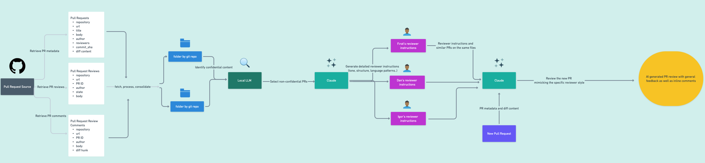

# PR Review Style Imitator

A tool that analyzes and imitates a reviewer's pull request review style to help generate consistent code reviews that match their unique voice and technical focus areas.

*Pipeline diagram showing the flow from PR metadata through style analysis to final review generation*

## How It Works

The tool follows a four-stage pipeline as shown in the diagram:

1. **Data Collection**: Fetches PR metadata, diffs, reviews, and comments
2. **Content Classification**: Uses local LLM (Qwen 2.5) to identify confidential content
3. **Style Analysis**: Leverages Claude 3.5 Sonnet to generate reviewer-specific instructions
4. **Style Application**: Applies captured review patterns to new PRs

## Key Features

- **Confidentiality Aware**: Filters out PRs containing sensitive information before analysis
- **Multi-Reviewer Support**: Captures and applies different reviewers' unique styles
- **Context-Aware**: Uses file history and similar PRs to inform new reviews
- **Extensible Pipeline**: Built on Haystack for easy component swapping

## Project Structure
- `src/`
  - `notebooks/` # Jupyter notebooks implementing the pipeline
    - `1.llm_classify_pr.ipynb` # Confidentiality classification
    - `2.llm_generate_reviewer_prompts.ipynb` # Style analysis
    - `3.llm_apply_reviewer_style.ipynb` # Review generation
  - `scripts/` # Supporting Python scripts
    - `fetch_pr_diffs.py` # PR diff retrieval
  - `utils/` # Shared utilities
- `data/` # (not included in repo)
  - `input/` # Raw PR data
  - `processed/` # Classified and enriched PRs
  - `reviewer_instructions/` # Generated review style guides
  - `generated_reviews/` # Style-applied PR reviews

(In `data/` each repository has its own folder)

## Setup

1. Clone this repository
2. Create a `.env` file with required API keys:
   - `ANTHROPIC_API_KEY`: For Claude 3.5
3. Install dependencies: `poetry install`
4. Set up Ollama locally with the Qwen 2.5 model

`fetch_pr_diffs.py` requires access to the GitHub repository. This script fetches the git repository to retrieve PR diffs based on the provided PR metadata in `data/input/`.

## Pipeline Details

### 1. PR Classification
- Uses local Qwen 2.5 model via Ollama
- Identifies sensitive information in PR content
- Provides reasoning for classifications
- Filters confidential PRs from further processing

### 2. Style Analysis
- Analyzes reviewer's historical comments and reviews
- Captures technical focus areas and preferences
- Generates detailed review style instructions
- Considers file-specific review patterns

### 3. Review Generation
- Takes new PR metadata and diff as input
- Finds similar historical PRs for context
- Uses Claude 3.5 to generate reviews matching style
- Maintains technical accuracy while matching voice

## Technical Stack

- **Python 3.12**
- **Haystack AI**: Pipeline orchestration
- **Ollama**: Local LLM integration
- **Claude 3.5**: Advanced language model
- **Poetry**: Dependency management

## Note on Data Privacy

This repository excludes input and output data as it was developed using internal PR data. When using this tool, ensure you have appropriate permissions for the PR content you analyze.

## License

This project is licensed under the MIT License - see the [LICENSE](LICENSE) file for details.
